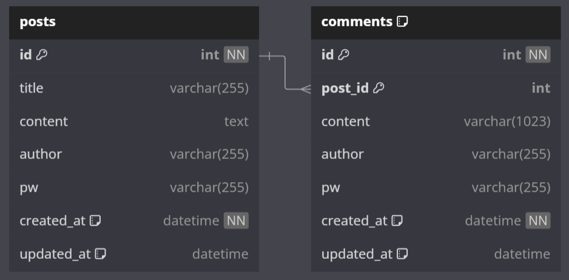

# 무엇을?
게시글 CRUD, 댓글 CRUD 구현

## 어떻게?

### 개발 환경
| 구분      | 이름        |
|-----------|-------------|
|프레임워크  |Spring Boot 3|
|           |Java 17|
|           |3.3.1|
|           |Gradle|
|데이터베이스|MariaDB|

### API 명세서

| Category | Func            | Method | URI                        |
|----------|-----------------|--------|----------------------------|
| 게시글   | 게시글 전체 조회  | GET    | /api/posts                 |
|          | 게시글 작성      | POST   | /api/post                  |
|          | 게시글 조회      | GET    | /api/post/{id}             |
|          | 게시글 수정      | PUT    | /api/post/{id}             |
|          | 게시글 삭제      | DELETE | /api/post/{id}             |
| 댓글     | 댓글 전체 조회    | GET    | /api/{postId}/comments     |
|          | 댓글 작성        | POST   | /api/{postId}/comment/{id} |
|          | 댓글 수정        | PUT    | /api/{postId}/comment/{id} |
|          | 댓글 삭제        | DELETE | /api/{postId}/comment/{id} |

### 데이터베이스
